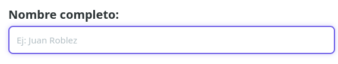
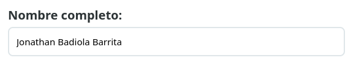
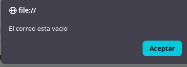
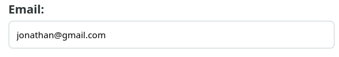
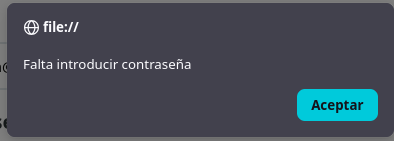
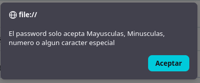
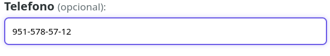
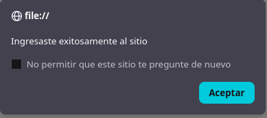

                      PORTADA
                
                instituto tecnologico de oaxaca
                Ing. en sistemas computacionales
                
                nombre: Badiola Barrita Jonathan
                
                grupo: 7SB
                
                maestra: Martinez Nieto Adelina

Instacion 

para la instalacion ocuparemos 
      <script src="js/utileria.js"></script>
      <link rel="stylesheet" href="css/utileria.css" />
estos son para que el programa funcione y se vea bien


CASOS DE USO: 

El sistema consiste en un formulario de validación desarrollado con **HTML, CSS y JavaScript**. Antes de permitir el acceso al usuario, se verifican distintos campos para asegurar que la información ingresada cumple con los requisitos establecidos.

---

## 1. Validación del nombre

El campo **Nombre completo** es obligatorio. Si el usuario intenta continuar sin escribir un nombre, el sistema mostrará un mensaje indicando que el campo está vacío.



Cuando el usuario introduce un nombre válido (solo letras, espacios y vocales acentuadas), la validación se completa correctamente.



---

## 2. Validación del correo electrónico

El correo electrónico también es un campo obligatorio y debe tener un formato válido.

Si el usuario deja el campo vacío, se muestra la siguiente alerta:



Cuando el correo cumple con el formato establecido (`usuario@dominio.com`), la validación se realiza correctamente.



---

## 3. Validación de la contraseña

La contraseña debe cumplir con los siguientes requisitos:

- Al menos 8 caracteres.
- Una letra mayúscula.
- Una letra minúscula.
- Un número.
- Un carácter especial.

Si el usuario no introduce una contraseña, el sistema mostrará el siguiente mensaje:



Si la contraseña no cumple con los requisitos establecidos, se mostrará una alerta indicando que el formato es incorrecto.



Cuando la contraseña cumple con todas las condiciones, la validación es correcta.


---

## 4. Validación del teléfono

El teléfono es un campo **opcional**.

Si el usuario decide proporcionarlo, deberá introducir exactamente diez dígitos utilizando el formato:

```
951-654-57-34
```

Cuando el formato es correcto, la validación finaliza satisfactoriamente.



Si el usuario deja este campo vacío, el sistema continúa con el proceso de validación, ya que no es un requisito obligatorio.


---

## 5. Validación de la edad

La fecha de nacimiento es obligatoria y se utiliza para calcular la edad del usuario.

El sistema determina automáticamente si el usuario es mayor o menor de edad.

- Si el usuario tiene menos de **18 años**, el acceso es rechazado y se muestra un mensaje indicando que no puede ingresar al sistema.
- Si el usuario es mayor de edad y todas las validaciones anteriores fueron exitosas, el sistema permite el acceso.

---

## 6. Acceso al sistema

Cuando todas las validaciones son correctas, el sistema informa que el usuario ha ingresado exitosamente.


